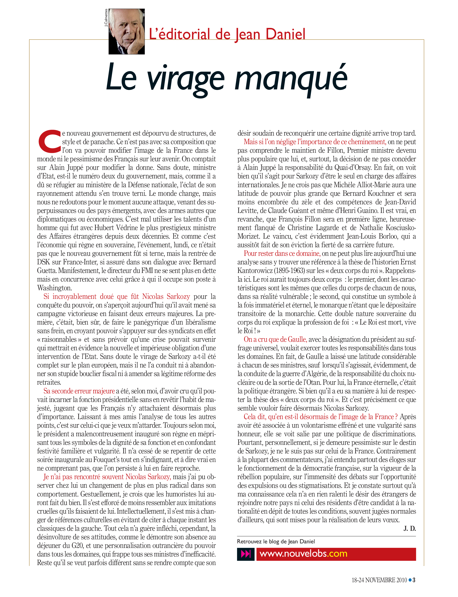
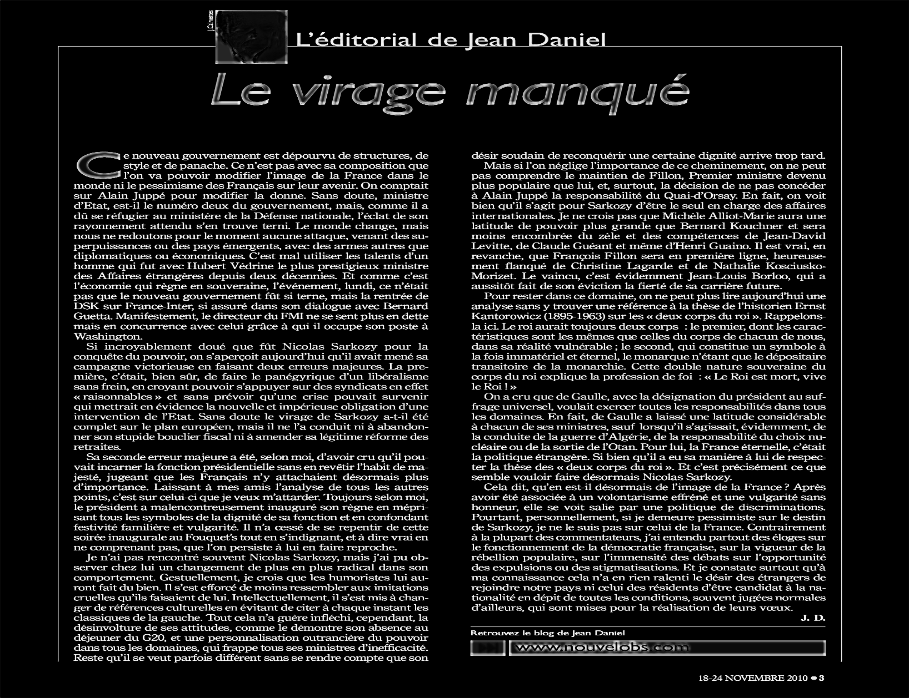
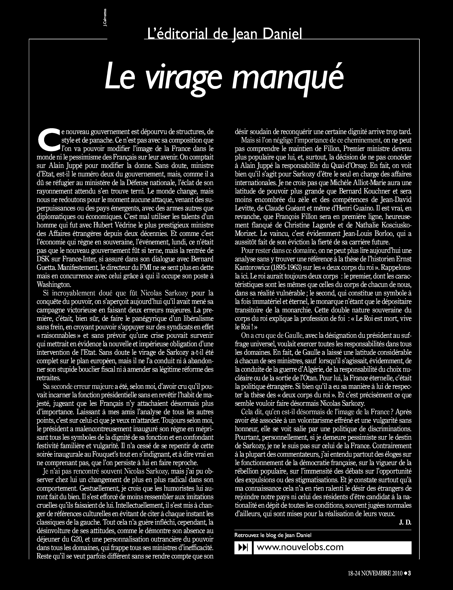

# Document-image-Binarization
Binarization of text document images using a Fully connected CNN architecture in Keras.

Here is a plot which shows the losses and accuracies while training the model.

Sample-
ORIGINAL IMAGE

PREDICTED PROBABILITY VALUES OF THE MODEL

GROUND TRUTH

